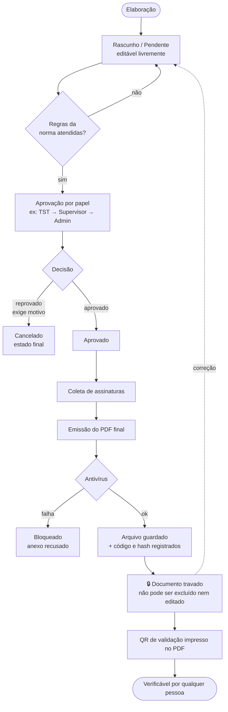
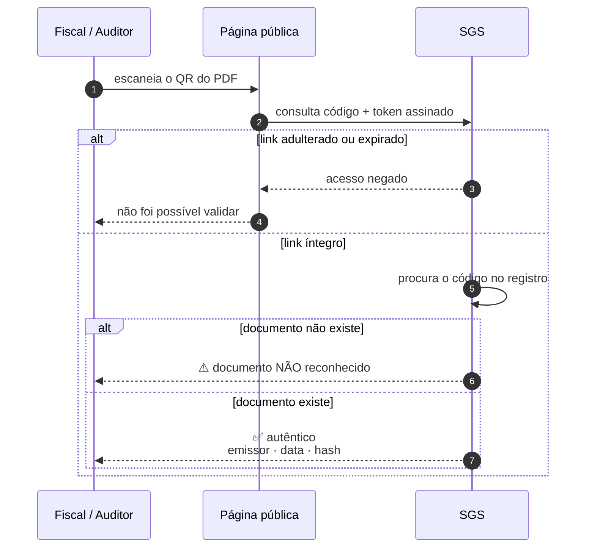
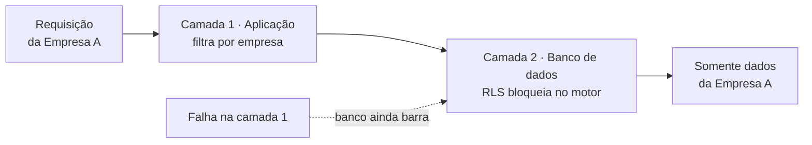

# SGS — Governança Documental

**Para quem:** cliente, auditor, certificadora, área de SST e jurídico.
**O que é:** como o SGS garante que um documento de segurança do trabalho é autêntico,
rastreável e não pode ser alterado ou apagado depois de emitido.

Não é documentação técnica — não exige saber programar. Para arquitetura e código, veja
[`architecture/SGS-FLUXOGRAMA-COMPLETO.md`](./architecture/SGS-FLUXOGRAMA-COMPLETO.md).

> **Diagramas em imagem** (para anexar em apresentação/PDF de auditoria):
> [ciclo do documento](./assets/architecture/sgs-gov-1-ciclo.svg) ·
> [validação por QR](./assets/architecture/sgs-gov-2-validacao.svg) ·
> [isolamento entre empresas](./assets/architecture/sgs-gov-3-isolamento.svg)

---

## 1. O que o sistema garante (e o que não garante)

Ser explícito sobre os limites é parte da governança. Um controle que promete mais do que
entrega é pior que a ausência do controle.

| Garantia | Como | Limite honesto |
|---|---|---|
| **Autenticidade** | Todo PDF final tem código único + hash SHA-256 registrados no servidor no momento da emissão | O hash é calculado no servidor sobre o arquivo emitido |
| **Verificação por terceiro** | QR no PDF abre página pública que confirma o documento contra o registro | Confirma autenticidade e origem; não expõe o conteúdo |
| **Imutabilidade após emissão** | Documento com PDF final não pode ser excluído nem editado; correção exige nova versão | Versão anterior permanece registrada |
| **Rastreabilidade** | Trilha forense registra emissão, assinatura, cancelamento, expiração e acesso a vídeo | — |
| **Isolamento entre empresas** | Duas camadas independentes: aplicação + banco de dados (RLS) | — |
| **Antivírus em anexos** | Todo upload é varrido; se o antivírus não responde, o anexo **é recusado** | Proteção contra arquivo malicioso, não contra conteúdo incorreto |

### O que o SGS **não** é

> **As assinaturas do SGS não são assinatura digital qualificada (ICP-Brasil).**
> O sistema declara isso internamente (`legal_assurance: not_legal_strong`) e o PDF é rotulado
> de forma honesta conforme o tipo de prova realmente coletada.

Isso é uma decisão de projeto, não uma lacuna escondida. O SGS registra **prova operacional**:
quem assinou, quando, de qual dispositivo, sobre qual versão do documento. Para atos que exijam
assinatura qualificada, use certificado ICP-Brasil em paralelo.

---

## 2. Tipos de prova de assinatura

O rótulo impresso no PDF corresponde **exatamente** ao que foi coletado. Não existe rótulo
mais forte do que a prova.

| Tipo | O que é | Verificado pelo servidor? |
|---|---|---|
| **PIN (`hmac`)** | Signatário digita um PIN pessoal, validado no servidor (PBKDF2/HMAC-SHA256) | **Sim** — única prova verificada criptograficamente |
| **Desenhada (`drawn`)** | Imagem da assinatura feita na tela do dispositivo | Não — é captura de evidência |
| **Enviada (`upload`)** | Imagem de assinatura enviada como arquivo | Não — é captura de evidência |
| **Aceite (`acknowledgement`)** | Registro de ciência/aceite operacional, sem imagem | Não — é registro de ato |

**Por que isso importa:** antes de um endurecimento feito no sistema, era possível registrar
uma assinatura com o rótulo `digital` (impresso como "Assinatura Digital") **sem que nenhuma
verificação criptográfica tivesse ocorrido**. Hoje há uma allowlist: os rótulos legados
(`digital`, `facial`, `simple`, `cpf_pin`) são aceitos apenas para leitura de dados históricos
e **não podem ser usados em novas assinaturas**.

---

## 3. Ciclo de vida de um documento

Vale para APR, PT, DDS, DID, ARR, RDO, Checklist, Auditoria, CAT e Não Conformidade.
Muda o nome dos estados; a espinha é a mesma.

**Ponto-chave para auditoria:** o cadeado no passo `M` é técnico, não uma convenção. A
tentativa de excluir um documento com PDF final é **recusada pelo sistema** — não depende de
disciplina do usuário nem de permissão de perfil.

---

## 4. Como validar um documento sem acesso ao sistema

É o que um fiscal ou auditor faz em campo, sem login e sem conta:

1. Aponta a câmera para o **QR impresso no PDF**.
2. Abre a página pública de validação (`/validar/<código>`).
3. O sistema confirma, contra o registro do servidor:
   - se o documento **existe** e é autêntico;
   - **quem** emitiu e **quando**;
   - o **hash** do arquivo oficial.

O link do QR é **assinado**: alterar o código na URL invalida o acesso. E o retorno é
**mínimo por design** (LGPD): confirma a autenticidade sem expor o conteúdo do documento nem
dados pessoais além do necessário.

---

## 5. Trilha forense

Eventos gravados de forma permanente, além do log de auditoria comum:

| Evento | Quando |
|---|---|
| `FINAL_DOCUMENT_REGISTERED` | PDF final emitido e registrado |
| `SIGNATURE_RECORDED` | Assinatura coletada |
| `DOCUMENT_CANCELED` | Documento cancelado |
| `DOCUMENT_EXPIRED` | Validade vencida |
| `FINAL_DOCUMENT_REMOVED` / `DOCUMENT_HARD_REMOVED` | Remoção (casos excepcionais, ex.: direito de exclusão LGPD) |
| `VIDEO_ATTACHMENT_UPLOADED` / `_ACCESSED` / `_REMOVED` | Anexo de vídeo enviado, **acessado** ou removido |

O acesso a vídeo ser registrado permite responder "quem viu esta gravação e quando" — pergunta
comum em investigação de acidente.

---

## 6. Proteção de dados pessoais (LGPD)

| Tema | Como funciona |
|---|---|
| **CPF e dados médicos** | Criptografados em repouso (AES-256-GCM). O CPF é buscado por hash, nunca por texto aberto |
| **Consentimento para IA** | A assistente Sophie só processa dados com consentimento ativo e versionado. Sem consentimento, o acesso é bloqueado |
| **Direito de exclusão** | Anonimiza os dados pessoais do titular preservando os documentos de SST exigidos por norma |
| **Transferência internacional** | Declarada no registro de subprocessadores, com finalidade e categorias de dados |
| **Retenção** | Rotina automática de retenção documental |
| **Exclusão em cascata** | Registros anonimizados somem de listagens, contagens e exportações |

> **Tensão real, resolvida explicitamente:** o direito de exclusão (LGPD Art. 18) conflita com a
> obrigação de guardar documentos de SST. O SGS resolve **anonimizando o titular** e mantendo o
> documento — atende a LGPD sem destruir a prova exigida por norma trabalhista.

---

## 7. Isolamento entre empresas (multi-tenant)

Uma instalação do SGS atende várias empresas. O isolamento tem **duas camadas independentes**:

A segunda camada é **RLS** (Row Level Security), aplicada pelo próprio PostgreSQL. Uma falha de
programação na aplicação **não** vaza dados de outra empresa: o banco recusa.

E o padrão é **negar**: sem identificação da empresa, a consulta retorna **zero registros** —
nunca "todos". O erro seguro é não ver nada, não ver demais.

---

## 8. Perguntas frequentes de auditoria

**O documento pode ser alterado depois de emitido?**
Não. Após a emissão do PDF final, edição e exclusão são recusadas pelo sistema. Correção exige
nova versão, e a anterior fica registrada.

**Como sei que o PDF que tenho em mãos é o original?**
Pelo QR: a página pública mostra o hash do arquivo oficial registrado na emissão.

**Vocês usam certificado ICP-Brasil?**
Não. As assinaturas são prova operacional (quem, quando, sobre qual versão), não assinatura
qualificada. O PDF é rotulado conforme a prova real coletada — ver seção 2.

**Se o antivírus estiver fora do ar, o anexo passa?**
Não. O comportamento é *fail-closed*: sem confirmação de que o arquivo está limpo, o anexo é
recusado.

**O que acontece com os documentos se um colaborador pedir exclusão dos dados (LGPD)?**
Os dados pessoais dele são anonimizados; os documentos de SST permanecem, como exige a norma
trabalhista. Ver seção 6.

**Uma empresa consegue ver dados de outra?**
Não. São duas camadas independentes (aplicação + RLS no banco), e o padrão é negar. Ver seção 7.

---

## Onde aprofundar

| Assunto | Documento |
|---|---|
| Estados e transições de cada documento | [`state-machines.md`](./state-machines.md) |
| Arquitetura e diagramas técnicos | [`architecture/SGS-FLUXOGRAMA-COMPLETO.md`](./architecture/SGS-FLUXOGRAMA-COMPLETO.md) |
| Segurança e governança (visão técnica) | [`consulta-rapida/seguranca-e-governanca.md`](./consulta-rapida/seguranca-e-governanca.md) |
| PDFs finais e storage | [`consulta-rapida/pdfs-finais-e-storage.md`](./consulta-rapida/pdfs-finais-e-storage.md) |
| Backup e continuidade | [`consulta-rapida/disaster-recovery-e-backup.md`](./consulta-rapida/disaster-recovery-e-backup.md) |

## Fontes

Este documento foi escrito a partir do código, não de material de marketing:

- `backend/src/modules/signatures/signature-proof.util.ts` — tipos de prova e `legal_assurance`
- `backend/src/modules/forensic-trail/forensic-trail.constants.ts` — eventos da trilha
- `backend/src/modules/document-registry/` — código, hash e registro
- `backend/src/shared/security/file-inspection.service.ts` — antivírus fail-closed
- `backend/src/shared/tenant/` — isolamento e RLS
- `backend/src/modules/privacy-governance/subprocessors.registry.ts` — subprocessadores
