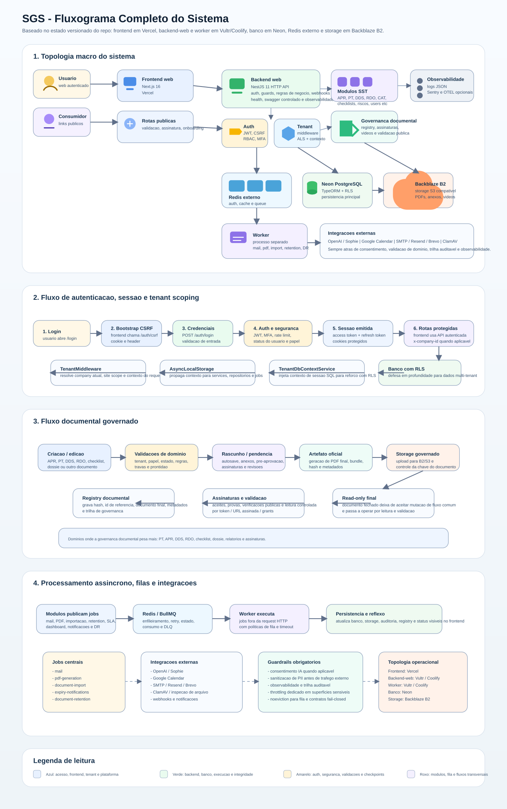

# SGS - Fluxograma Completo do Sistema

Fluxograma visual repo-backed do SGS, consolidando:

- topologia macro
- autenticacao e tenant scoping
- governanca documental
- processamento assincrono
- integracoes externas

## Diagrama visual

Arquivo da imagem:

- [sgs-fluxograma-completo.svg](C:/Users/User/Documents/trae_projects/sgs-seguraca/docs/assets/architecture/sgs-fluxograma-completo.svg)

## Fontes de verdade usadas

- `README.md`
- `backend/README.md`
- `backend/src/app.module.ts`
- `backend/src/main.ts`
- `backend/src/worker.module.ts`
- `docs/consulta-rapida/arquitetura-e-stack.md`
- `docs/consulta-rapida/mapa-de-modulos.md`
- `docs/architecture/SGS-SYSTEM-ARCHITECTURE-DIAGRAM.md`

## O que este material cobre

- frontend, backend-web e worker
- Redis, Neon e storage S3 compativel
- auth, JWT, CSRF, RBAC e contexto de tenant
- modulos operacionais principais
- registry documental, assinatura e leitura publica
- filas BullMQ e jobs pesados
- OpenAI, mail, calendar e antivirus

## O que complementar se precisar aprofundar

- `docs/consulta-rapida/arquitetura-e-rotas.md`
- `docs/database-schema.md`
- `docs/diagrama-banco-mermaid.md`
- `docs/state-machines.md`
