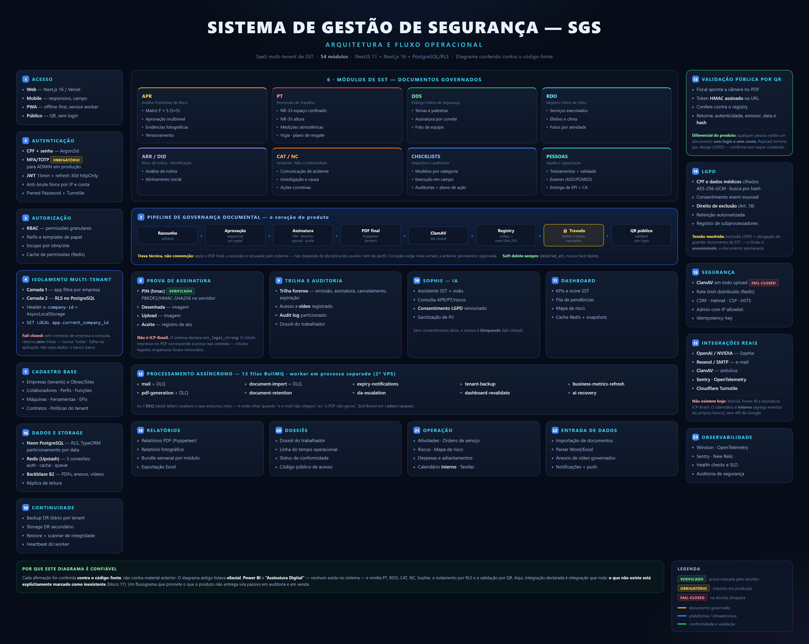
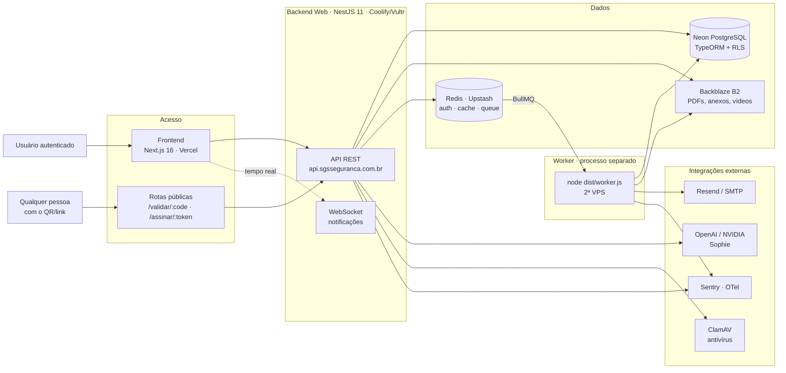
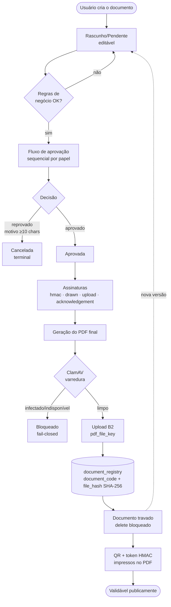
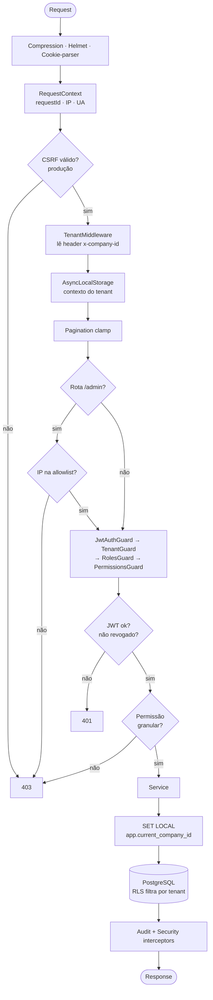
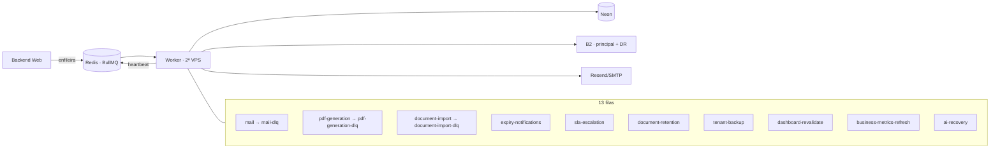
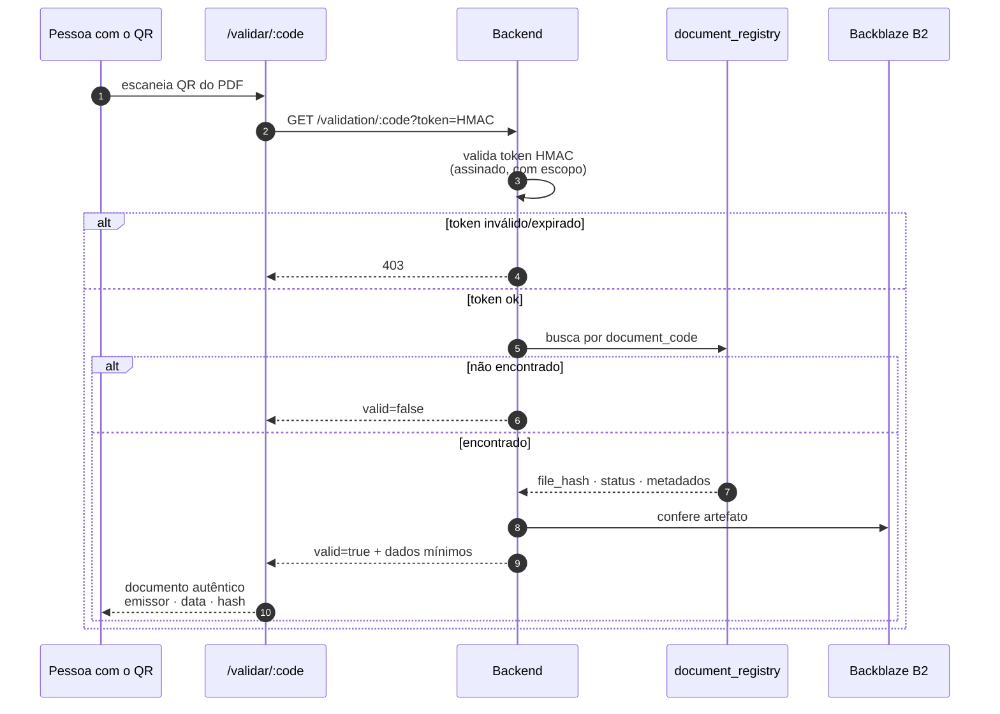

# SGS — Fluxograma Completo do Sistema

## Visão geral em uma imagem

Painel único com os 54 módulos, o pipeline de governança e os controles — para
apresentação, auditoria e onboarding.



[PNG 4000×3184](../assets/architecture/sgs-fluxograma-sistema.png) ·
[PDF vetorial](../assets/architecture/sgs-fluxograma-sistema.pdf) ·
[fonte HTML](../assets/architecture/src/sgs-fluxograma-sistema.html)

```bash
# regerar após editar o HTML (roda da raiz do repositório)
node docs/assets/architecture/src/render.js \
  docs/assets/architecture/src/sgs-fluxograma-sistema.html \
  docs/assets/architecture/sgs-fluxograma-sistema.png 2

node docs/assets/architecture/src/render.js \
  docs/assets/architecture/src/sgs-fluxograma-sistema.html \
  docs/assets/architecture/sgs-fluxograma-sistema.pdf
```

---

## Diagramas por recorte

Fluxogramas do SGS em Mermaid (versionados, renderizam direto no GitHub).
Cada diagrama cobre um recorte; comece pelo macro e desça conforme a dúvida.

- [1. Topologia macro](#1-topologia-macro)
- [2. Ciclo de vida de um documento governado](#2-ciclo-de-vida-de-um-documento-governado)
- [3. Requisição autenticada: middleware e escopo de tenant](#3-requisição-autenticada-middleware-e-escopo-de-tenant)
- [4. Processamento assíncrono (filas)](#4-processamento-assíncrono-filas)
- [5. Validação pública por QR](#5-validação-pública-por-qr)

> **Export em imagem** (para apresentação/PDF): [`1-topologia`](../assets/architecture/sgs-fluxo-1-topologia.svg) ·
> [`2-ciclo-documento`](../assets/architecture/sgs-fluxo-2-ciclo-documento.svg) ·
> [`3-request-tenant`](../assets/architecture/sgs-fluxo-3-request-tenant.svg) ·
> [`4-filas`](../assets/architecture/sgs-fluxo-4-filas.svg) ·
> [`5-validacao-qr`](../assets/architecture/sgs-fluxo-5-validacao-qr.svg)
>
> Os SVGs são **gerados a partir do Mermaid abaixo** (a fonte de verdade). Para regerar após
> editar um diagrama, veja [Como regerar os SVGs](#como-regerar-os-svgs).

---

## 1. Topologia macro



**Deploy — atenção:** nenhum dos dois é automático hoje.

| Componente | Onde | Como sobe |
|---|---|---|
| Frontend | Vercel | `vercel --prod` **manual** (sem integração git) |
| Backend Web + Worker | Coolify/Vultr | Webhook não confiável — confirmar `deployments[0].commit` via API |
| Migrations | Neon | `npm run migration:run` **manual**, nunca no boot |

---

## 2. Ciclo de vida de um documento governado

O coração do SGS. Vale para APR, PT, DDS, DID, ARR, RDO, Checklist, Auditoria, CAT e NC —
muda o nome dos estados, não a espinha.



**Travas que valem citar em auditoria:**

- **Fail-closed no antivírus** — se o ClamAV não responde, o anexo **não** entra. Não existe "passa mesmo assim".
- **Delete bloqueado após PDF final** — `remove()` lança `BadRequestException` quando existe `pdf_file_key`. Documento emitido não some.
- **Soft delete, nunca hard delete** — `deleted_at`; o registro fica para trilha.
- **Hash amarrado** — o `file_hash` (SHA-256) e o `document_code` vão pro registry; o QR aponta pro mesmo código.

---

## 3. Requisição autenticada: middleware e escopo de tenant



**Duas camadas independentes de isolamento** — a aplicação filtra por `company_id` **e** o
Postgres aplica RLS via `SET LOCAL app.current_company_id`. Uma falha na aplicação não vaza
dados de outro tenant: o banco ainda barra.

**RLS é fail-closed:** sem contexto de tenant, a query retorna **zero linhas** (não "todas").
Por isso jobs/crons cross-tenant precisam de `tenantService.run({ isSuperAdmin: true })` —
sem isso, rodam em silêncio sobre nada.

> `DATABASE_URL` **nunca** pode usar endpoint `-pooler` do Neon: quebra o `SET LOCAL` e,
> com ele, a RLS. Só `DATABASE_MIGRATION_URL` pode.

---

## 4. Processamento assíncrono (filas)



As três filas de **DLQ** (`mail-dlq`, `pdf-generation-dlq`, `document-import-dlq`) recebem o
que estourou retry — é onde olhar quando "o e-mail não chegou" ou "o PDF não gerou".
Bull Board em `/admin/queues` (Basic Auth).

---

## 5. Validação pública por QR

Sem login. É o que um fiscal/auditor faz em campo apontando a câmera.



O payload público é **mínimo por design** (LGPD): confirma autenticidade sem expor o conteúdo
do documento nem PII além do necessário.

---

## Onde aprofundar

| Dúvida | Documento |
|---|---|
| Estados e transições de cada entidade | [`../state-machines.md`](../state-machines.md) |
| Tabelas, colunas e relacionamentos | [`../database-schema.md`](../database-schema.md) · [`../diagrama-banco-mermaid.md`](../diagrama-banco-mermaid.md) |
| Endpoints REST | [`../api-reference.md`](../api-reference.md) |
| Onde mexer no código | [`../consulta-rapida/onde-alterar-o-que.md`](../consulta-rapida/onde-alterar-o-que.md) |
| Deploy backend/worker | [`../deploy/coolify-vultr-backend-web-worker.md`](../deploy/coolify-vultr-backend-web-worker.md) |
| Backup e restore | [`../consulta-rapida/disaster-recovery-e-backup.md`](../consulta-rapida/disaster-recovery-e-backup.md) |

## Como regerar os SVGs

Os SVGs em `docs/assets/architecture/sgs-fluxo-*.svg` são gerados a partir dos blocos Mermaid
deste arquivo. Depois de editar um diagrama, regere para não deixar imagem e fonte
dessincronizadas.

```bash
# 1. extrair os blocos mermaid deste md para arquivos .mmd
node -e "
const fs=require('fs');
const md=fs.readFileSync('docs/architecture/SGS-FLUXOGRAMA-COMPLETO.md','utf8');
const blocks=[...md.matchAll(/\`\`\`mermaid\n([\s\S]*?)\`\`\`/g)].map(m=>m[1]);
const names=['1-topologia','2-ciclo-documento','3-request-tenant','4-filas','5-validacao-qr'];
blocks.forEach((b,i)=>fs.writeFileSync('/tmp/d'+names[i]+'.mmd',b));
"

# 2. gerar os SVGs (reusa o Chromium do Puppeteer, não baixa outro)
#    puppeteer-config.json: {"executablePath":"<caminho do chrome>","args":["--no-sandbox"]}
for n in 1-topologia 2-ciclo-documento 3-request-tenant 4-filas 5-validacao-qr; do
  npx -y @mermaid-js/mermaid-cli@11 \
    -i "/tmp/d$n.mmd" \
    -o "docs/assets/architecture/sgs-fluxo-$n.svg" \
    -p puppeteer-config.json -b white
done
```

## Fontes de verdade

Diagramas conferidos contra o código, não contra documentação anterior:

- `backend/src/app.module.ts` · `worker.module.ts` · `main.ts`
- `backend/src/infra/config/modules.config.ts`
- `backend/src/shared/tenant/` · `shared/guards/` · `shared/security/file-inspection.service.ts`
- `backend/src/modules/document-registry/`
- Filas: `grep -r "registerQueue" backend/src`

Correções feitas nesta revisão (a documentação anterior divergia do código):

- **Google Calendar não é integração ativa** — o módulo `calendar` agrega eventos das próprias
  entidades no próprio banco, sem chamar API do Google. O diagrama anterior mostrava
  `MODULES --> GCAL` como fluxo em uso.
- **13 filas BullMQ**, não 6 — faltavam `tenant-backup`, `dashboard-revalidate`,
  `business-metrics-refresh`, `ai-recovery` e as 3 DLQs.
- **ClamAV** não aparecia no diagrama, apesar de bloquear todo upload (fail-closed).
- O fluxograma anterior era um stub apontando para um SVG por caminho **absoluto**
  (`C:/Users/User/...`), que quebrava para qualquer outra pessoa.
